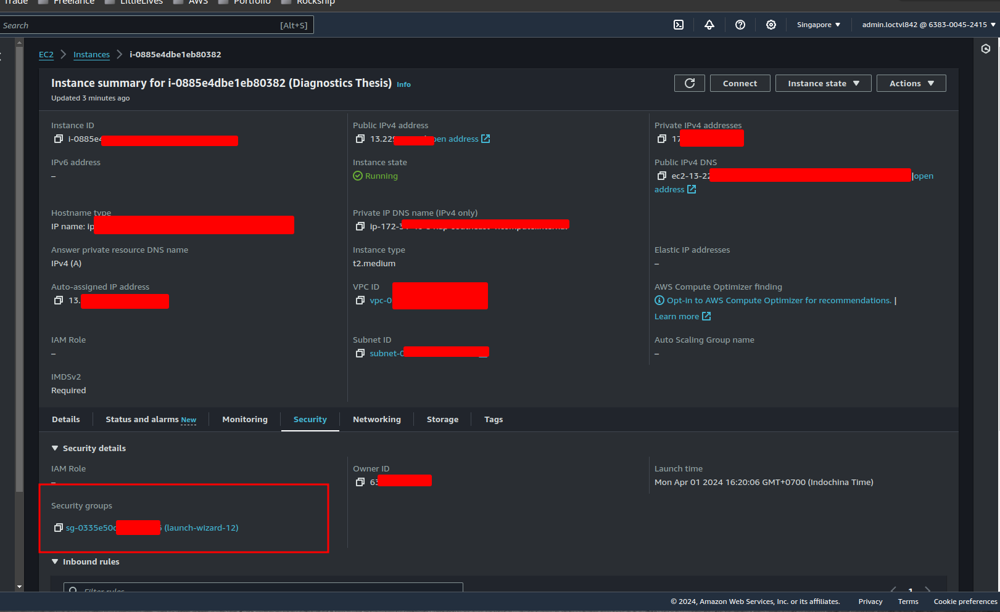
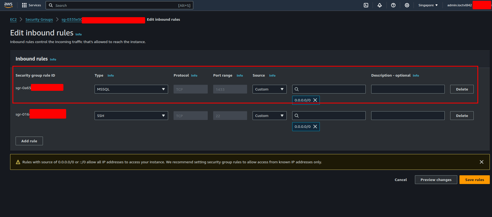

# Deploying SQL Server on AWS

SQLserver require at least 2GB of RAM to run. So, I will use t2.medium instance type to deploy SQL Server.

## Setting EC2 Instance

- **AMI**: Ubuntu Server 20.04 with SQL Server 2022
- **Instance Type**: t2.medium

## Setting Security Group

- Open ports 1433 and 3389

- Edit inbound rules:

  - **Type:** Custom TCP Rule
  - **Port Range:** 1433
  - **Source:** Anywhere-Ipv4

Output should be like this:

