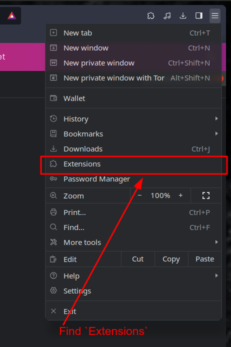
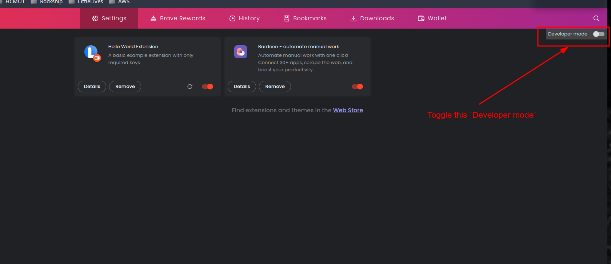
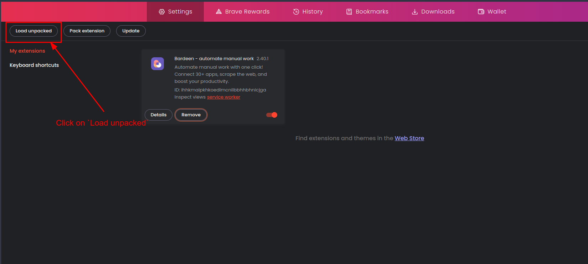
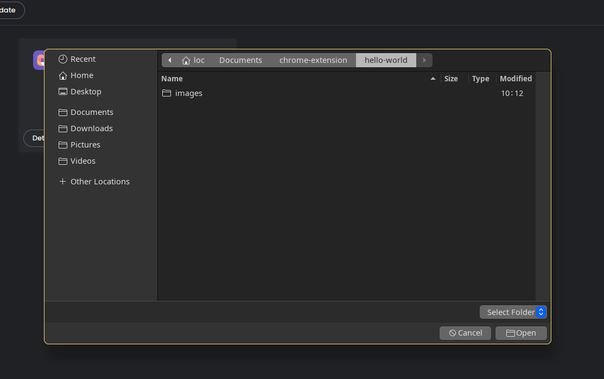
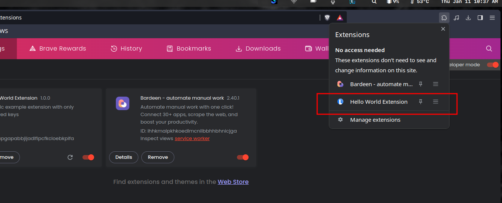
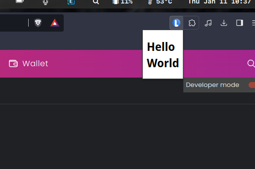

# Chrome Extension Development

## Setting Up Your Web Project

### Project Structure

- Project Path: `$HOME/Documents/chrome-extension/hello-world/`

```
 └──      images/
 │  ├────      icon-128.png
 │  └────      icon-48.png
 ├──      index.html
 └──      manifest.json
```

- Simple `index.html`:

```html
<!DOCTYPE html>
<html lang="en">
<head>
  <meta charset="UTF-8">
  <meta name="viewport" content="width=device-width, initial-scale=1.0">
  <meta http-equiv="X-UA-Compatible" content="ie=edge">
  <link rel="icon" type="image/x-icon" href="images/icon-48.png">
  <title></title>
</head>
<body>
  <h1>Hello World</h1>
</body>
</html>
```

- The core of your extension is the `manifest.json` file.

```json
<!DOCTYPE html>
<html lang="en">
<head>
  <meta charset="UTF-8">
  <meta name="viewport" content="width=device-width, initial-scale=1.0">
  <meta http-equiv="X-UA-Compatible" content="ie=edge">
  <link rel="icon" type="image/x-icon" href="images/icon-48.png">
  <title></title>
</head>
<body>
  <h1>Hello World</h1>
</body>
</html>
```

Read more about how to create above manifest.json [here](https://developer.chrome.com/extensions/manifest).

### Load The Extension

- Navigate to `Extensions` in the Chrome menu.



- Enable `Developer Mode`.



- Load the extension.



- Select the folder containing the extension.



By following these steps, you can successfully set up and load your Chrome extension for testing and development. Remember to adapt the project structure and code according to your extension's specific requirements.





For more detailed information, refer to the official [Chrome Extension documentation](https://developer.chrome.com/docs/extensions/reference/manifest#popup-with-permissions).


