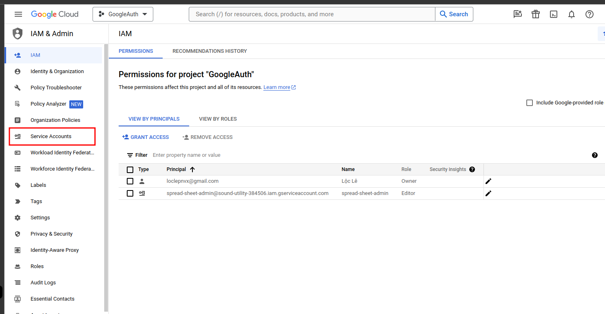
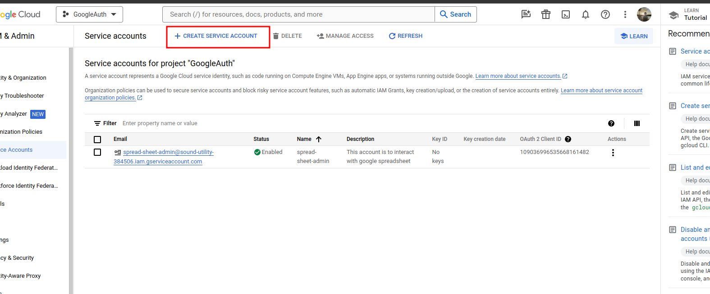
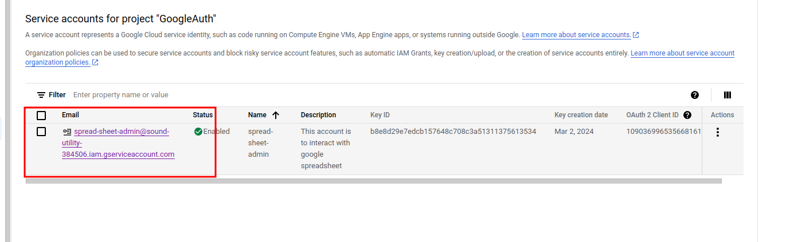

# Interacting with spreadsheets

**1. Go to [Google Cloud Console](https://console.cloud.google.com/welcome?hl=vi&project=sound-utility-384506)**

**2. Navigate to IAM & Admin > Service accounts**
- Click on `IAM & Admin`
- On the left sidebar, click on `Service accounts`

**3. Create a new service account**

**4. Select the email address of the service account you just created**

**5. Navigate to the `Keys` tab**
- Create a new key
- Download the key as a JSON file
