# Intergrating Builder.io

## The fastest way (playground):

```sh
npm init builder.io@latest
```

- Choose the workspace to mount the project in the the link it open:

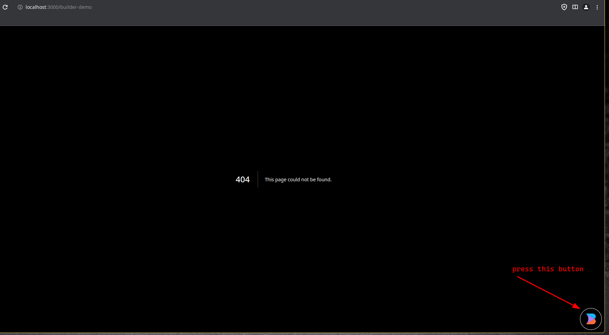
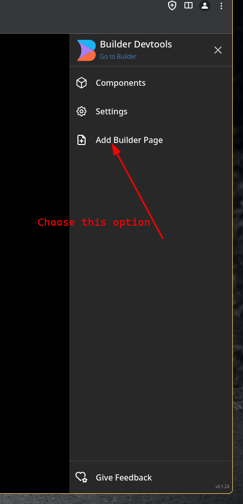
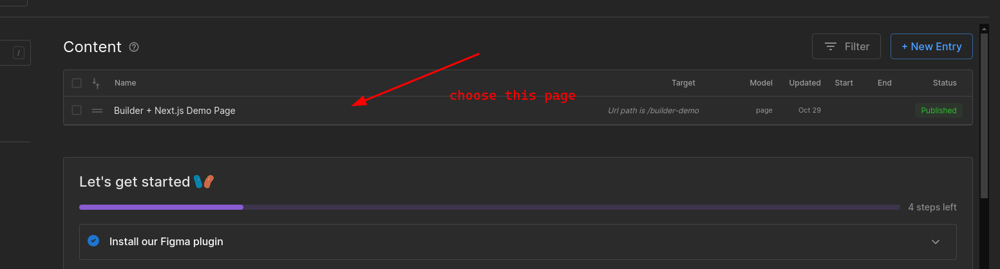
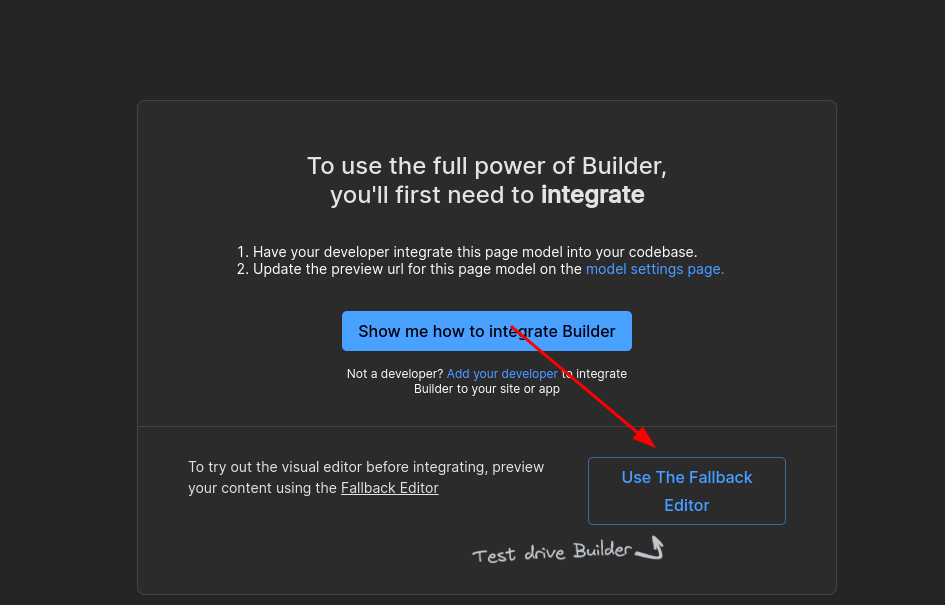
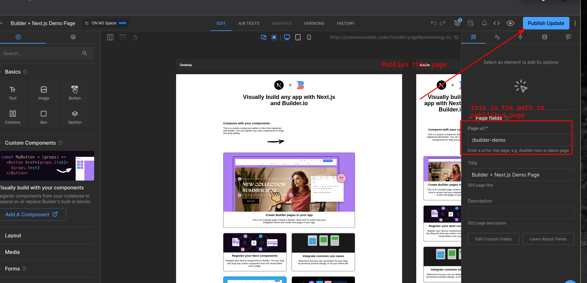
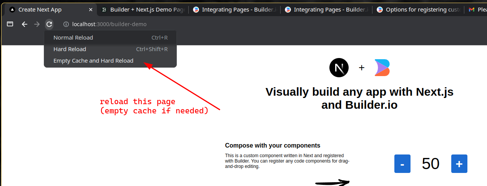

### Now let's try to create new component:

When running command:

```sh
npm run dev
```

The following code in file `src/app/[...page]/page.tsx` will try to fetch all pages of current content (See all content [here](https://builder.io/content)):
```typescript
  const content = await builder
    // Get the page content from Builder with the specified options
    .get("page", {
      userAttributes: {
        // Use the page path specified in the URL to fetch the content
        urlPath: "/" + (props?.params?.page?.join("/") || ""),
      },
    })
    // Convert the result to a promise
    .toPromise();
```

We can log this content in the console, it will include the `id` of current content.

From now on we need to keep focus on 2 pages: `localhost:3000/builder-demo` (The page we use to develop component) and `builder.io/content/<content_id>` (The page to drag and drop component.)

1. **Create a simple component `ProductCard`:**

Create file `src/components/ProductCard/ProductCard.tsx` with the following code:

```typescript
"use client";
interface ProductCardProps {
  image: string;
  description: string;
  brand: {
    name: string;
  };
  formattedPrice: string;
}

const ProductCard = (props: ProductCardProps) => {
  return (
    <div className="container">
      <h1>This a product card</h1>
    </div>
  );
};

export default ProductCard;
```

2. **Register the component from file `src/builder-registry.ts`:**

```typescript
"use client";
import { Builder } from "@builder.io/react";
import ProductCard from "./components/ProductCard/ProductCard";

Builder.registerComponent(ProductCard, {
  name: "ProductCard",
})
```

3. **Check it out at the preview page of builder**

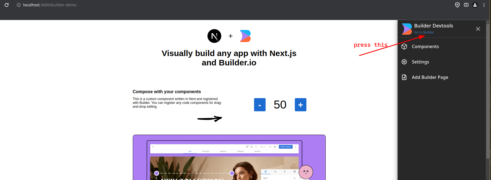
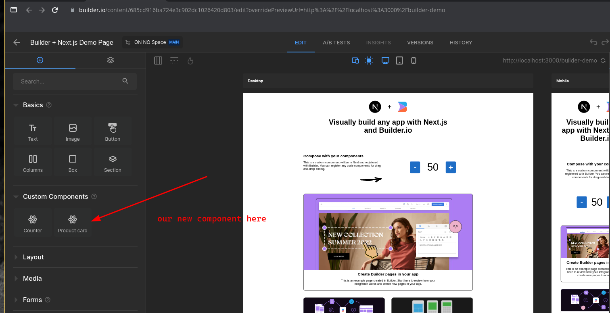

Drag and drop the component into random place
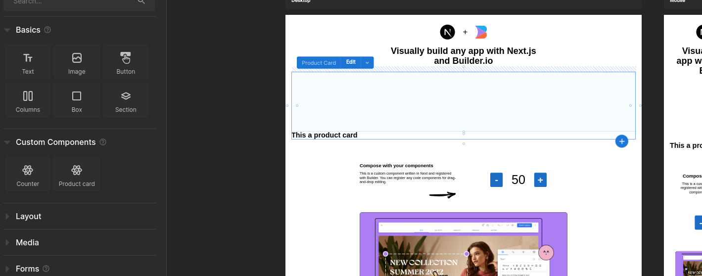

Now publish the new component:

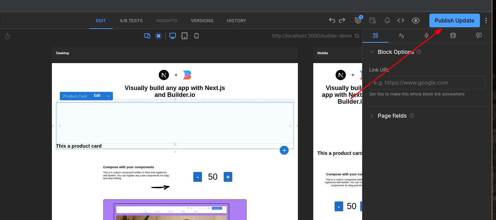

Go back to `localhost:3000/builder-demo` and refresh (clear cache if needed)

And now the component is published:
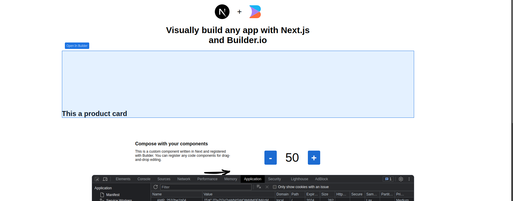

4. **Develop the component**:

Update the compoennt in `src/components/ProductCard/ProductCard.tsx`

```typescript
"use client";
import React from "react";
import styles from "./styles.module.css";
import Image from "next/image";

interface ProductCardProps {
  image: string;
  description: string;
  brand: {
    name: string;
  };
  formattedPrice: string;
}

const ProductCard = (props: ProductCardProps) => {
  const { image, description, brand = {name: 'loc'}, formattedPrice } = props;

  return (
    <a className={styles["product-card"]} href="#dolce-gabbana-cropped">
      <Image className={styles["product-card__image"]} src={image} alt="product" />
      <p className={styles["product-card__brand"]}>{brand.name}</p>
      <p className={styles["product-card__description"]}>{description}</p>
      <p className={styles["product-card__price"]}>{formattedPrice}</p>
      <button className={styles["product-card__btn-wishlist"]}>
        <svg viewBox="0 0 18 16" xmlns="http://www.w3.org/2000/svg">
          <path
            d="M9.01163699,14.9053769 C8.72930024,14.7740736 8.41492611,14.6176996 8.07646224,14.4366167 C7.06926649,13.897753 6.06198912,13.2561336 5.12636931,12.5170512 C2.52930452,10.4655288 1.00308384,8.09476443 1.00000218,5.44184117 C0.997549066,2.99198843 2.92175104,1.01242822 5.28303025,1.01000225 C6.41066623,1.00972036 7.49184369,1.4629765 8.28270844,2.2678673 L8.99827421,2.9961237 L9.71152148,2.26559643 C10.4995294,1.45849728 11.5791258,1.0023831 12.7071151,1.00000055 L12.7060299,1.00000225 C15.0693815,0.997574983 16.9967334,2.97018759 17.0000037,5.421337 C17.0038592,8.07662382 15.4809572,10.4530151 12.8850542,12.5121483 C11.9520963,13.2521931 10.9477036,13.8951276 9.94340074,14.4354976 C9.60619585,14.6169323 9.29297309,14.7736855 9.01163699,14.9053769 Z"
            strokeWidth="2"
          />
        </svg>
      </button>
    </a>
  );
};

export default ProductCard;
```

Update file `src/components/ProductCard/styles.module.css`:

```css
.product-card {
  position: relative;
  display: flex;
  flex-direction: column;
  align-items: center;
  text-align: center;
  width: 20rem;
  background-color: white;
  border-radius: 10px;
  overflow: hidden;
  box-shadow: 2px 2px 5px 0px rgba(0, 64, 128, 0.1);
}

.product-card__image {
  max-width: 100%;
  height: auto;
}

.product-card__description,
.product-card__price,
.product-card__brand {
  margin: 0.2rem 0;
  font-size: 1rem;
}

.product-card__brand {
  font-weight: bold;
  text-transform: uppercase;
}

.product-card__description {
  font-weight: normal;
}

.product-card__price {
  font-weight: bold;
}

.product-card__btn-wishlist {
  position: absolute;
  top: 10px;
  right: 10px;
  border-radius: 50%;
  height: 40px;
  width: 40px;
  border: none;
  background-color: white;
  padding: 12px 10px 10px;
  box-shadow: 2px 2px 5px 0px rgba(0, 64, 128, 0.1);
}

.product-card__btn-wishlist svg {
  fill: lightgrey;
}
```

The component is updated.
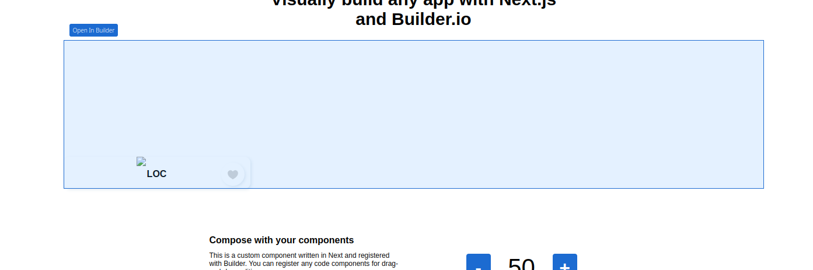

5. **Let's add some value for it:**

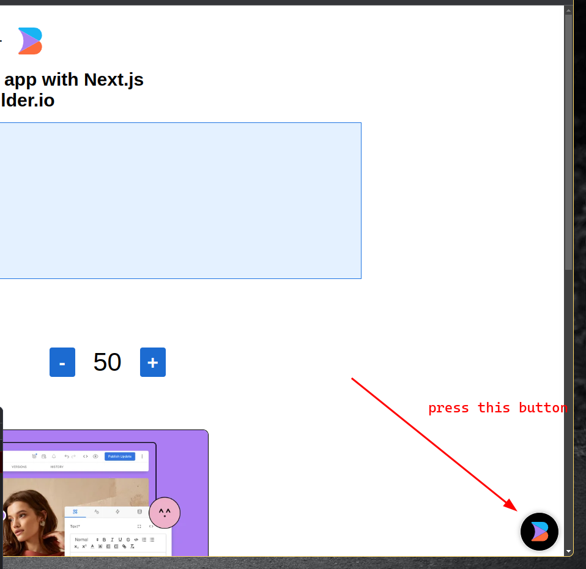
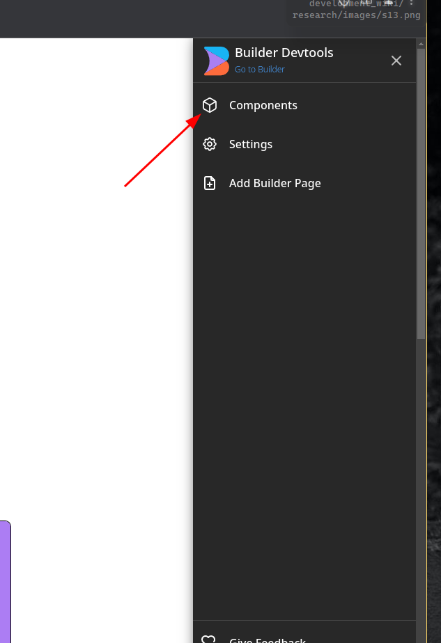
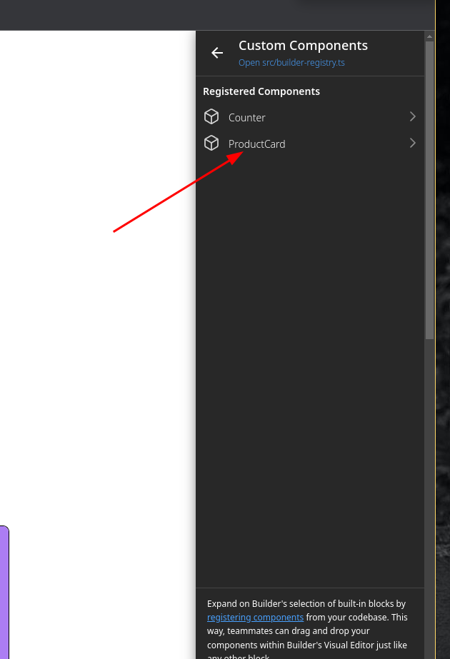
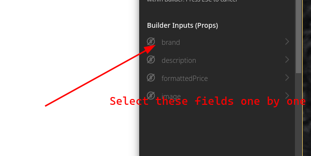
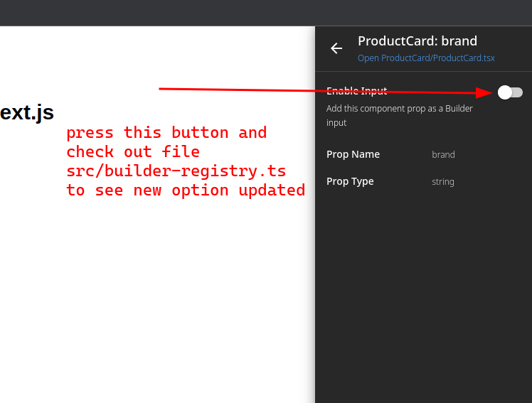

You may need to edit the file `src/builder-registry.ts` if needed (E.g. I don't want my brand is type string, I want it is an object) (see more options [here](https://www.builder.io/c/docs/custom-components-input-types)):

```typescript
```

- Do the same thing as step 3 and check the page `builder.io/content/<content_id>`

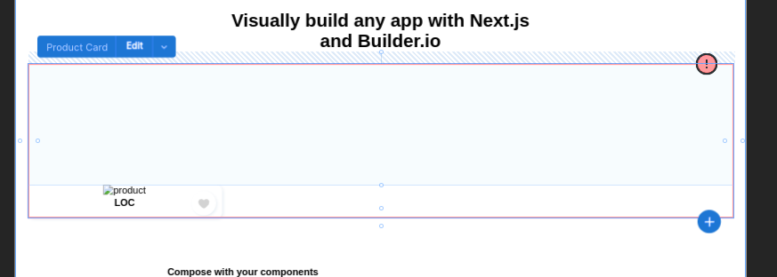

Press edit to add some initial value for it, I'll prepare a sample:

```json
{
image: "https://cdn-images.farfetch-contents.com/14/82/97/77/14829777_26844957_1000.jpg",
brand: {
  id: 123,
  name: "Dolce & Gabbana"
},
description: "cropped leaf-print shirt",
price: 795,
formattedPrice: "$795"
};
```

- You may got error if using above image, just troubleshoot it by edit `next.config.js`:

```js
const withBuilderDevTools = require("@builder.io/dev-tools/next")();

/** @type {import('next').NextConfig} */
const nextConfig = withBuilderDevTools({
  images: {
    domains: ["cdn.builder.io", "cdn-images.farfetch-contents.com"],
  }
});

module.exports = nextConfig;
```

Ok finally, let's see the result:
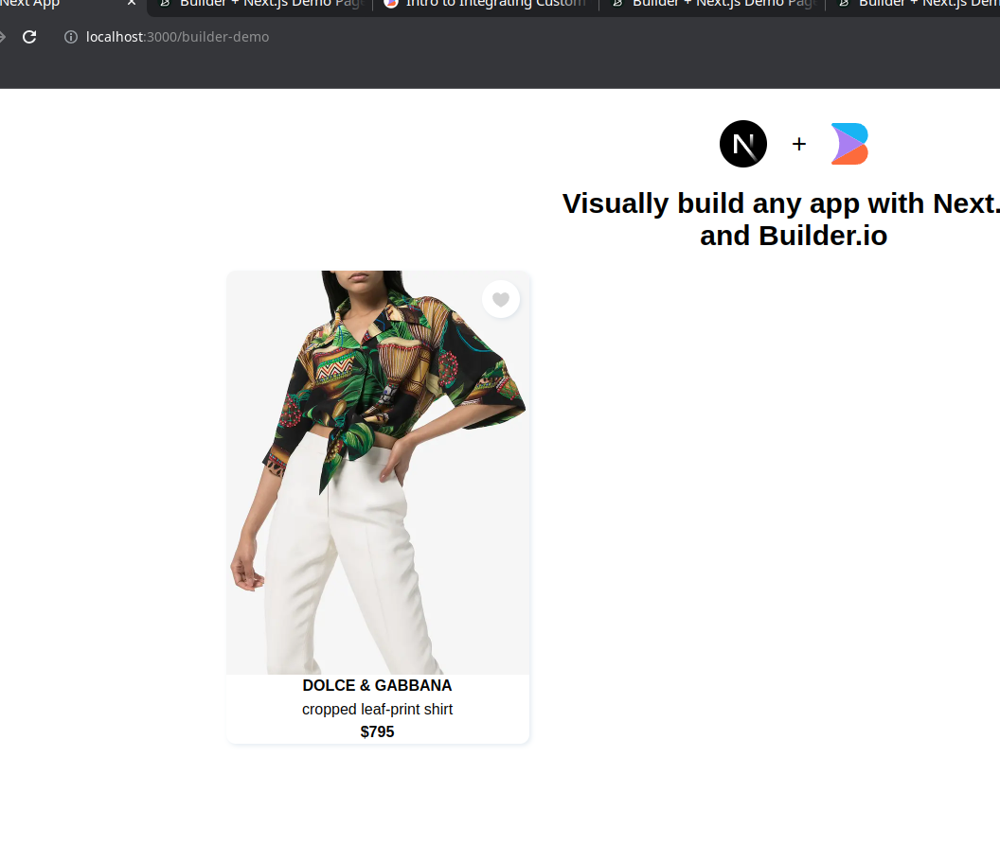
