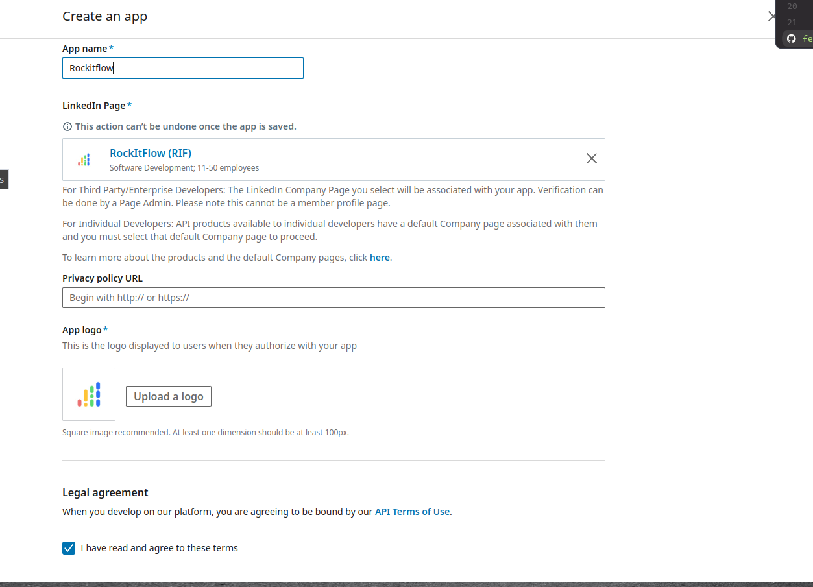

# Setup Login with LinkedIn

## Create LinkedIn App

Go to [LinkedIn Developer Console](https://www.linkedin.com/developers/apps) and create a new app.

## Create LinkedIn Sign In Product

- Select product `Sign In with LinkedIn using OpenID Connect` and request for access.

# Reference

- [LinkedIn OpenID Connect](https://learn.microsoft.com/en-us/linkedin/consumer/integrations/self-serve/sign-in-with-linkedin-v2?context=linkedin%2Fconsumer%2Fcontext)
- [https://repost.aws/knowledge-center/cognito-linkedin-auth0-social-idp](https://repost.aws/knowledge-center/cognito-linkedin-auth0-social-idp)
