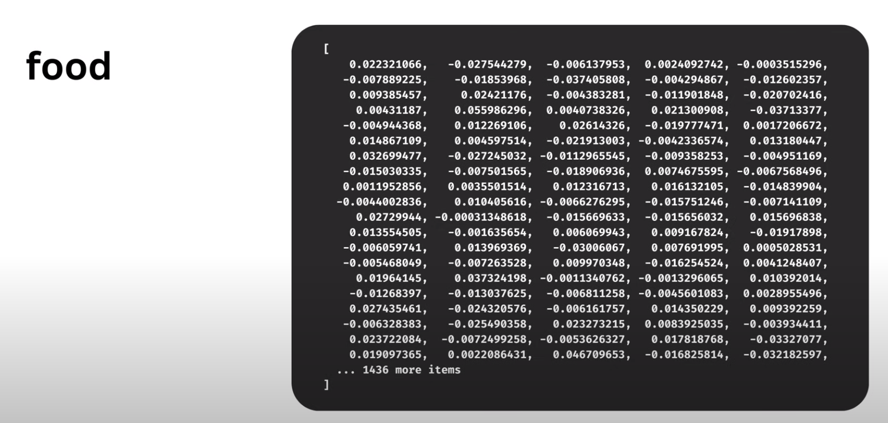

# Vector Embeddings

Vector embeddings is a popular technique to represent information in a format that can be easily stored and processed by algorithms, especially deep learning models. This `information` can be text, images, or videos.

**Example:** `OpenAIEmbeddings` will generate a word for example `food` into a format in form of vector.


Based on vector embeddings, machine learning algorithms can perform tasks such as search, clustering, and recommendation.

Try this in terminal

```sh
curl https://api.openai.com/v1/embeddings \
  -H "Authorization: Bearer $OPENAI_API_KEY" \
  -H "Content-Type: application/json" \
  -d '{
    "input": "food",
    "model": "text-embedding-ada-002",
    "encoding_format": "float"
  }'
```

The output will be:

```sh
{
  "object": "list",
  "data": [
    {
      "object": "embedding",
      "index": 0,
      "embedding": [
        0.02232054,
        -0.026822733,
        -0.0063044303,
        0.0023582105,
        ...
        -0.0066784797,
        -0.011792753
      ]
    }
  ],
  "model": "text-embedding-ada-002-v2",
  "usage": {
    "prompt_tokens": 1,
    "total_tokens": 1
  }
}
```

## Types

### 1. Word/Text Embeddings

### 2. Document Embeddings

### 3. Sentence Embeddings

### 4. Graph Embeddings

### 5. Image Embeddings

### Uses

### 1. Recommendation Systems

### 2. Anomaly Detection

### 3. Transfer Learning

### 4. Visualisations

High dimensional data can be converted into 2D or 3D embeddings using techniques like `tsne` or `PCA` to visualize clusters or relationships of data.

### 5. Information Retrieval

`DocumentLoader` from `Langchain`

### 6. Audio + Speech processing

### 7. Facial Recognition

## Terminology

- **Semantics**: The branch with linguistics and logic concerned with meaning.
