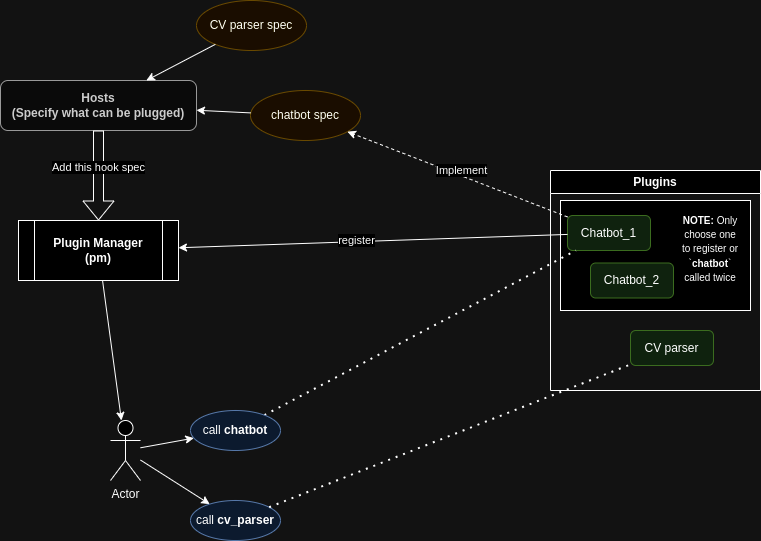

# Example Requirements

- Hook `loctvl842/Chatbot`
- Hook `vietphuong/Chatbot`
- Hook `vietphuong/CV-parser`

# Libraries

## Pluggy



- **Installation:**

```sh
pip install pluggy
```

- **Sample code:**

```python
import pluggy

hookspec = pluggy.HookspecMarker("myproject")
hookimpl = pluggy.HookimplMarker("myproject")


class AppSpec:
    """A hook specification namespace."""

    @hookspec
    def chatbot(self, message: str):
        """My special little hook that you can customize."""

    @hookspec
    def cv_parser(self, file: str):
        """My special little hook that you can customize."""


class Chatbot_1:
    """A hook implementation chatbot."""

    @hookimpl
    def chatbot(self, message: str):
        print("Inside Chatbot_1.chatbot()")
        return f"{message} - I'm Chatbot_1!"


class Chatbot_2:
    """A 2nd hook implementation chatbot."""

    @hookimpl
    def chatbot(self, message: str):
        print("Inside Chatbot_2.chatbot()")
        return f"{message} - I'm Chatbot_2!"


class CvParser:
    """A hook implementation cv_parser."""

    @hookimpl
    def cv_parser(self, file):
        print("Inside CvParser.cv_parser()")
        return f"{file} - I'm CvParser!"


# create a manager and add the spec
pm = pluggy.PluginManager("myproject")
pm.add_hookspecs(AppSpec)

# register plugins
pm.register(Chatbot_1())
pm.register(Chatbot_2())
pm.register(CvParser())

# call our hook
chabot_results = pm.hook.chatbot(message="Hello world!")
cv_parser_results = pm.hook.cv_parser(file="cv.pdf")

print(f"chabot_results: {chabot_results}")
print(f"cv_parser_results: {cv_parser_results}")
```

**Output:**
```sh
Inside Chatbot_2.chatbot()
Inside Chatbot_1.chatbot()
Inside CvParser.cv_parser()
chabot_results: ["Hello world! - I'm Chatbot_2!", "Hello world! - I'm Chatbot_1!"]
cv_parser_results: ["cv.pdf - I'm CvParser!"]
```

## Yapsy

https://github.com/tibonihoo/yapsy

- Hard to use
- Only 108 stars
